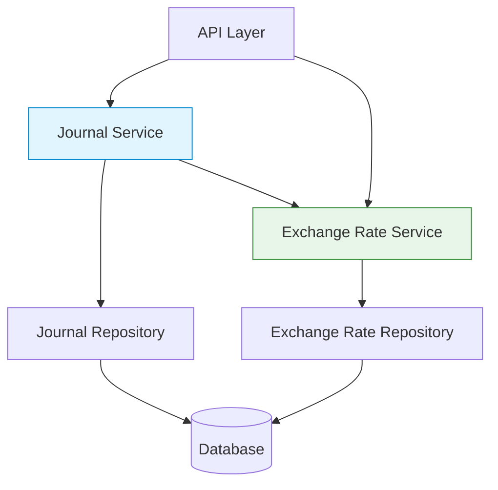

# Multi-Currency Journal Entries - High-Level Design

## 1. System Architecture



### Component Descriptions
- **Journal Service**: Handles journal and transaction operations, enforces business rules
- **Exchange Rate Service**: Manages currency conversion using `ExchangeRateService`
- **Repositories**: Implement data access using PostgreSQL with pgx driver
- **Database**: PostgreSQL with existing `exchange_rates`, `journals`, and `transactions` tables

## 2. Key Components

### 2.1 Journal Service
- **Responsibilities**:
  - Process journal creation and updates via `journalService`
  - Handle multi-currency transaction validation
  - Coordinate with `ExchangeRateService` for conversions
  - Maintain journal balance in base currency (stored in `journal.CurrencyCode`)
  - Enforce transaction validation using `validateJournalBalance`
  - Handle transaction reversal logic

### 2.2 Exchange Rate Service
- **Implementation**: `exchangeRateService` in `internal/core/services/exchange_rate_service.go`
- **Key Methods**:
  - `GetExchangeRate(ctx, fromCode, toCode string) (*domain.ExchangeRate, error)`
  - `CreateExchangeRate(ctx, req dto.CreateExchangeRateRequest, creatorUserID string) (*domain.ExchangeRate, error)`
- **Features**:
  - Validates currency codes and rate values
  - Handles rate lookups with date consideration
  - Maintains audit trails via `AuditFields`
- **Dependencies**:
  - `ExchangeRateRepository` for data access
  - `CurrencyService` for currency validation

### 2.3 Database Schema Updates

#### Current Schema
```sql
-- journals table
CREATE TABLE journals (
    journal_id UUID PRIMARY KEY,
    workplace_id UUID NOT NULL,
    journal_date TIMESTAMPTZ NOT NULL,
    description TEXT,
    currency_code CHAR(3) NOT NULL,  -- Base currency of the journal
    status VARCHAR(20) NOT NULL,
    original_journal_id UUID,
    reversing_journal_id UUID,
    amount DECIMAL(19,6) NOT NULL,
    -- audit fields
    created_at TIMESTAMPTZ NOT NULL,
    created_by UUID NOT NULL,
    last_updated_at TIMESTAMPTZ,
    last_updated_by UUID
);

-- transactions table (current)
CREATE TABLE transactions (
    transaction_id UUID PRIMARY KEY,
    journal_id UUID NOT NULL REFERENCES journals(journal_id),
    account_id UUID NOT NULL,
    amount DECIMAL(19,6) NOT NULL,
    transaction_type VARCHAR(10) NOT NULL CHECK (transaction_type IN ('DEBIT', 'CREDIT')),
    currency_code CHAR(3) NOT NULL,  -- Currently must match journal.currency_code
    notes TEXT,
    transaction_date TIMESTAMPTZ NOT NULL,
    running_balance DECIMAL(19,6),
    -- audit fields
    created_at TIMESTAMPTZ NOT NULL,
    created_by UUID NOT NULL,
    last_updated_at TIMESTAMPTZ,
    last_updated_by UUID
);

-- exchange_rates table (existing)
CREATE TABLE exchange_rates (
    exchange_rate_id UUID PRIMARY KEY,
    from_currency_code CHAR(3) NOT NULL,
    to_currency_code CHAR(3) NOT NULL,
    rate DECIMAL(19,6) NOT NULL,
    date_effective TIMESTAMPTZ NOT NULL,
    -- audit fields
    created_at TIMESTAMPTZ NOT NULL,
    created_by UUID NOT NULL,
    last_updated_at TIMESTAMPTZ,
    last_updated_by UUID
);
```

#### Proposed Changes
```sql
-- Add to transactions table
ALTER TABLE transactions
ADD COLUMN original_amount DECIMAL(19, 6) NULL,
ADD COLUMN original_currency_code CHAR(3) NULL,
ADD COLUMN exchange_rate_id UUID NULL REFERENCES exchange_rates(exchange_rate_id);

-- Add check constraint for currency consistency
ALTER TABLE transactions
ADD CONSTRAINT chk_foreign_currency 
    CHECK (
        -- Either both original fields are NULL (single currency)
        (original_amount IS NULL AND original_currency_code IS NULL) OR
        -- Or both are set (multi-currency)
        (original_amount IS NOT NULL AND original_currency_code IS NOT NULL)
    );

-- Add index for better query performance
CREATE INDEX idx_transactions_currency ON transactions(original_currency_code);
CREATE INDEX idx_transactions_exchange_rate ON transactions(exchange_rate_id);
```

## 3. Data Flow

### 3.1 Transaction Creation
1. **API Request**:
   ```http
   POST /api/v1/transactions
   {
     "journal_id": "550e8400-e29b-41d4-a716-446655440000",
     "account_id": "550e8400-e29b-41d4-a716-446655440001",
     "original_amount": 100.00,
     "original_currency": "EUR",
     "transaction_type": "DEBIT"
   }
   ```

2. **Service Layer**:
   - Journal Service receives the request and loads the journal
   - If `original_currency` differs from `journal.CurrencyCode`:
     - Calls `exchangeRateService.GetExchangeRate(original_currency, journal.CurrencyCode)`
     - Validates the exchange rate exists and is valid
     - Calculates `amount = original_amount * exchange_rate`
   - Validates transaction using existing validation rules
   - Saves transaction with both original and converted amounts

3. **Persistence**:
   - Transaction is saved with:
     - `amount`: Converted to journal's base currency
     - `original_amount`: Original amount in source currency
     - `original_currency_code`: Source currency code
     - `exchange_rate_id`: Reference to the exchange rate used

### 3.2 Journal Validation
1. **Balance Validation** (in `journalService.validateJournalBalance`):
   ```go
   // Pseudo-code for validation logic
   func (s *journalService) validateJournalBalance(transactions []domain.Transaction) error {
       totalDebits := decimal.Zero
       totalCredits := decimal.Zero
       
       for _, txn := range transactions {
           if txn.TransactionType == domain.Debit {
               totalDebits = totalDebits.Add(txn.Amount)
           } else {
               totalCredits = totalCredits.Add(txn.Amount)
           }
       }
       
       if !totalDebits.Equal(totalCredits) {
           return fmt.Errorf("journal is not balanced: debits=%s, credits=%s", 
               totalDebits, totalCredits)
       }
       return nil
   }
   ```

2. **Currency Validation**:
   - All transactions must have either:
     - No `original_amount`/`original_currency` (single currency)
     - Valid `original_amount` and `original_currency` with matching `exchange_rate_id`
   - Exchange rate must exist from `original_currency` to journal's `currency_code`

3. **Audit Trail**:
   - All currency conversions are logged with:
     - Timestamp
     - User ID
     - Exchange rate used
     - Original and converted amounts

## 4. API Design

### 4.1 Create Transaction
```http
POST /api/v1/transactions
{
  "journal_id": "550e8400-e29b-41d4-a716-446655440000",
  "account_id": "550e8400-e29b-41d4-a716-446655440001",
  "original_amount": 100.00,
  "original_currency": "EUR",
  "transaction_type": "DEBIT",
  "notes": "Optional transaction notes",
  "transaction_date": "2025-07-09T00:00:00Z"
}
```

**Request Validation**:
- `journal_id`: Must be a valid UUID of an existing journal
- `account_id`: Must be a valid UUID of an existing account
- `original_amount`: Required if `original_currency` is provided, must be > 0
- `original_currency`: Must be a valid 3-letter currency code
- `transaction_type`: Must be either "DEBIT" or "CREDIT"
- `transaction_date`: Optional, defaults to current time

### 4.2 Get Transaction
```http
GET /api/v1/transactions/550e8400-e29b-41d4-a716-446655440002

{
  "transaction_id": "550e8400-e29b-41d4-a716-446655440002",
  "journal_id": "550e8400-e29b-41d4-a716-446655440000",
  "account_id": "550e8400-e29b-41d4-a716-446655440001",
  "amount": 110.00,
  "currency": "USD",
  "transaction_type": "DEBIT",
  "original_amount": 100.00,
  "original_currency": "EUR",
  "exchange_rate": 1.1,
  "exchange_rate_id": "550e8400-e29b-41d4-a716-446655440003",
  "notes": "Sample transaction",
  "transaction_date": "2025-07-09T00:00:00Z",
  "running_balance": 110.00,
  "journal_date": "2025-07-09T00:00:00Z",
  "journal_description": "Sample Journal Entry",
  "created_at": "2025-07-09T12:00:00Z",
  "created_by": "550e8400-e29b-41d4-a716-446655440004",
  "last_updated_at": "2025-07-09T12:00:00Z",
  "last_updated_by": "550e8400-e29b-41d4-a716-446655440004"
}
```

**Response Fields**:
- `amount`: Always in the journal's base currency
- `currency`: The journal's base currency
- `original_amount`: The original transaction amount (if different from journal's currency)
- `original_currency`: The original transaction currency (if different)
- `exchange_rate`: The rate used for conversion (if applicable)
- `exchange_rate_id`: Reference to the exchange rate record

## 5. Cross-Cutting Concerns

### 5.1 Error Handling
- **InvalidCurrency** (HTTP 400): 
  ```json
  {
    "code": "INVALID_CURRENCY",
    "message": "Currency code 'XYZ' is not supported"
  }
  ```
  
- **ExchangeRateNotFound** (HTTP 404):
  ```json
  {
    "code": "EXCHANGE_RATE_NOT_FOUND",
    "message": "No exchange rate found from EUR to USD for the given date"
  }
  ```
  
- **UnbalancedJournal** (HTTP 400):
  ```json
  {
    "code": "UNBALANCED_JOURNAL",
    "message": "Journal is not balanced: debits=1000.00, credits=950.00"
  }
  ```

### 5.2 Performance Considerations
- **Caching**:
  - Cache exchange rates in Redis with 5-minute TTL
  - Cache journal balances to avoid recalculating
  
- **Database**:
  - Add appropriate indexes on `transactions(journal_id, transaction_date)`
  - Consider partitioning large transaction tables by date
  
- **Concurrency**:
  - Use optimistic locking for journal updates
  - Implement retry logic for concurrent modifications

### 5.2 Performance Considerations
- Cache frequently used exchange rates
- Batch exchange rate lookups when processing multiple transactions
- Consider read replicas for reporting queries

## 6. Security & Compliance

### 6.1 Input Validation
- Validate all currency codes against the `currencies` table
- Enforce maximum precision (6 decimal places) for all amounts
- Sanitize all user-input strings to prevent injection

### 6.2 Access Control
- Users can only access journals for their authorized workplaces
- Exchange rate modifications require `FINANCE_ADMIN` role
- Audit all currency conversion operations

### 6.3 Data Protection
- Encrypt sensitive financial data at rest
- Mask sensitive fields in logs
- Implement proper session management and CSRF protection

## 7. Monitoring and Observability

### 7.1 Metrics
- `currency_conversions_total`: Counter of currency conversions
- `conversion_errors_total`: Failed conversion attempts
- `journal_balance_checks`: Balance validation metrics

### 7.2 Logging
```json
{
  "level": "info",
  "time": "2025-07-09T12:00:00Z",
  "msg": "Currency conversion",
  "from_currency": "EUR",
  "to_currency": "USD",
  "amount": 100.00,
  "converted_amount": 110.00,
  "exchange_rate": 1.1,
  "exchange_rate_id": "550e8400-e29b-41d4-a716-446655440003",
  "journal_id": "550e8400-e29b-41d4-a716-446655440000",
  "transaction_id": "550e8400-e29b-41d4-a716-446655440002",
  "user_id": "550e8400-e29b-41d4-a716-446655440004"
}
```

### 7.3 Alerting
- Alert on failed balance validations
- Monitor exchange rate age (stale rates)
- Track conversion rate anomalies

## 8. Future Enhancements

### 8.1 Short-term
- [ ] Automated exchange rate updates via external providers
- [ ] Bulk transaction import/export with multi-currency support
- [ ] Enhanced reporting with currency conversion history

### 8.2 Medium-term
- [ ] Support for multiple base currencies per organization
- [ ] Automated gain/loss calculations
- [ ] Tax implications of currency conversions

### 8.3 Long-term
- [ ] Real-time currency conversion
- [ ] Multi-currency budgeting and forecasting
- [ ] Integration with crypto currencies
