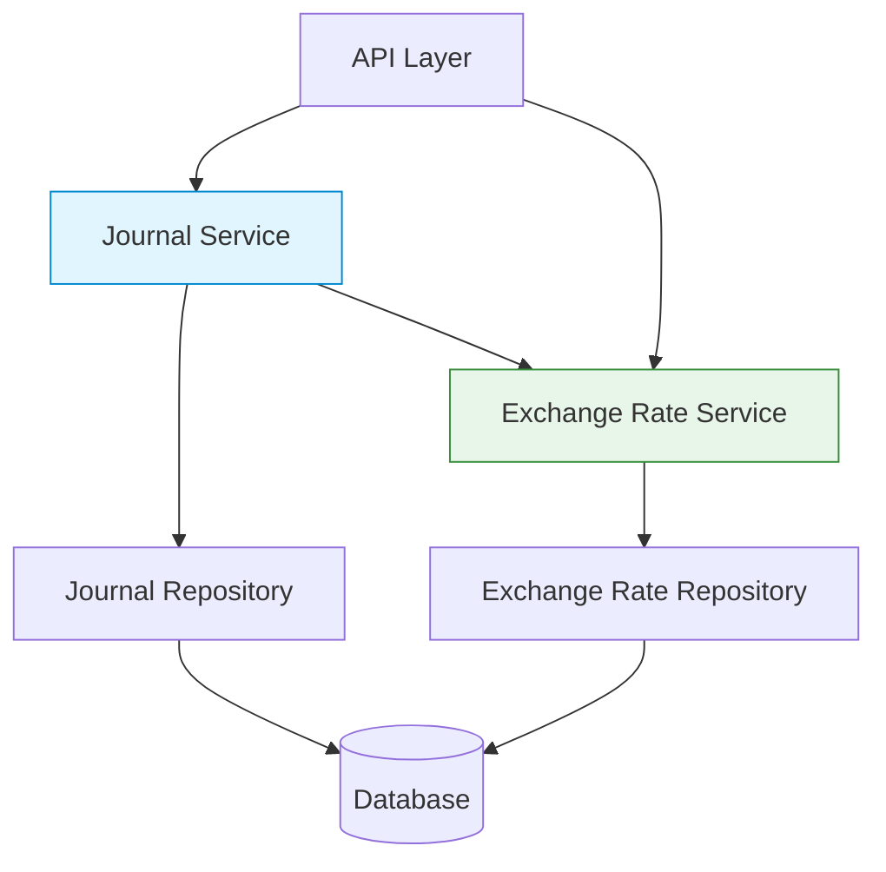

# Multi-Currency Journal Entries - High-Level Design

## 1. Overview
This document outlines the high-level design for implementing multi-currency support in journal entries, allowing transactions in different currencies within the same journal while maintaining accounting integrity.

## 2. System Architecture

### 2.1 Component Diagram



### 2.2 Component Responsibilities

#### Journal Service
- Manages journal and transaction lifecycle
- Enforces business rules and validations
- Coordinates currency conversions
- Maintains journal integrity

#### Exchange Rate Service
- Manages currency conversion rates
- Handles rate lookups and validations
- Provides historical rate support
- Implements rate caching

#### Database Layer
- Stores journals, transactions, and exchange rates
- Enforces data integrity constraints
- Provides transaction support

## 3. Data Model

### 3.1 Database Schema

#### Journals Table
```sql
CREATE TABLE journals (
    journal_id UUID PRIMARY KEY,
    workplace_id UUID NOT NULL,
    journal_date TIMESTAMPTZ NOT NULL,
    description TEXT,
    currency_code CHAR(3) NOT NULL,  -- Base currency
    status VARCHAR(20) NOT NULL,
    amount DECIMAL(19,6) NOT NULL,   -- Total in base currency
    -- audit fields
    created_at TIMESTAMPTZ NOT NULL,
    created_by UUID NOT NULL
);
```

#### Transactions Table (Updated)
```sql
ALTER TABLE transactions
ADD COLUMN original_amount DECIMAL(19, 6) NULL,
ADD COLUMN original_currency_code CHAR(3) NULL,
ADD COLUMN exchange_rate_id UUID NULL REFERENCES exchange_rates(exchange_rate_id);

-- Ensure currency consistency
ALTER TABLE transactions
ADD CONSTRAINT chk_foreign_currency 
    CHECK (
        (original_amount IS NULL AND original_currency_code IS NULL) OR
        (original_amount IS NOT NULL AND original_currency_code IS NOT NULL)
    );
```

## 4. API Specifications

### 4.1 Create Transaction
```http
POST /api/v1/transactions
{
  "journal_id": "550e8400-e29b-41d4-a716-446655440000",
  "account_id": "550e8400-e29b-41d4-a716-446655440001",
  "original_amount": 100.00,
  "original_currency": "EUR",
  "transaction_type": "DEBIT"
}
```

### 4.2 Get Transaction
```http
GET /api/v1/transactions/550e8400-e29b-41d4-a716-446655440002

{
  "transaction_id": "550e8400-e29b-41d4-a716-446655440002",
  "amount": 110.00,
  "currency": "USD",
  "original_amount": 100.00,
  "original_currency": "EUR",
  "exchange_rate": 1.1
}
```

## 5. Key Flows

### 5.1 Transaction Creation
1. Validate journal exists and is open
2. If `original_currency` differs from journal's currency:
   - Get exchange rate from Exchange Rate Service
   - Calculate amount in journal's currency
   - Store original amount and exchange rate reference
3. Validate journal balance in base currency
4. Save transaction
5. Update journal totals

### 5.2 Journal Validation
1. Sum all transaction amounts in journal's currency
2. Verify debits equal credits
3. Check all required exchange rates exist
4. Validate currency consistency

## 6. Error Handling

### 6.1 Error Responses
```json
{
  "code": "INVALID_CURRENCY",
  "message": "Currency 'XYZ' is not supported"
}

{
  "code": "EXCHANGE_RATE_NOT_FOUND",
  "message": "No rate available from EUR to USD"
}

{
  "code": "UNBALANCED_JOURNAL",
  "message": "Journal debits (1000.00) do not equal credits (950.00)"
}
```

## 7. Performance Considerations

### 7.1 Caching
- Cache exchange rates with 5-minute TTL
- Cache journal balances
- Use Redis for distributed caching

### 7.2 Database
- Index on `transactions(journal_id, transaction_date)`
- Consider partitioning by date for large volumes
- Use read replicas for reporting

## 8. Monitoring

### 8.1 Metrics
- `currency_conversions_total`
- `conversion_errors_total`
- `journal_balance_checks`

### 8.2 Logging
Structured logs for all currency conversions:
```json
{
  "level": "info",
  "time": "2025-07-09T12:00:00Z",
  "msg": "Currency conversion",
  "from_currency": "EUR",
  "to_currency": "USD",
  "amount": 100.00,
  "converted_amount": 110.00,
  "exchange_rate": 1.1
}
```

## 9. Security

### 9.1 Input Validation
- Validate all currency codes
- Sanitize all user inputs
- Enforce maximum precision (6 decimal places)

### 9.2 Access Control
- Role-based access control
- Audit all currency conversions
- Encrypt sensitive data at rest

## 10. Future Enhancements

### 10.1 Short-term
- [ ] Bulk import/export with multi-currency support
- [ ] Enhanced currency conversion reporting
- [ ] Automated rate updates

### 10.2 Long-term
- [ ] Multiple base currencies per organization
- [ ] Automated gain/loss calculations
- [ ] Real-time currency conversion
